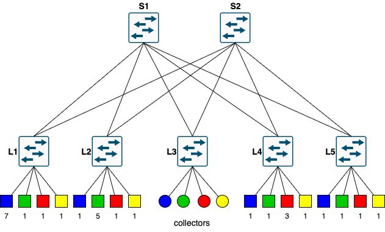

# SDN project 1: Load Balancer #
## Project Overview ##
This project implements an SDN load-balancing solution using a POX controller to manage and optimize network traffic over a multi-path network topology.

The use case is to coordinate data bursts generated by 28 workers (`w1` to `w28`) sending traffic to 4 collectors (`c1` to `c4`). This traffic simulates overlapping machine learning training procedures (represented by colors: blue, green, red, yellow), each with distinct trasnmsission sizes $D_v$, periods $T_v$, phase offsets $\phi_v$, and worker allocations.

## Network Topology ##
The network is emulated using Katharà and forms a 2-tier leaf-spine topology:
- spine switches: `s1` (DPID 101) and `s2` (DPID 102);
- leaf switches: `l1` (DPID 1) to `l5` (DPID 5);
    - workers are distributed across `l1`, `l2`, `l4` and `l5`;
    - collectors are connected to `l3`;
- SDN controller: a central controller connected to all switches via a management network;
- traffic constraints: all interfaces are rate-limited to 100 Mbps using Linux Traffic Control.



## Usage ##
1. Move to the `src` folder and install Python requirements with
```
pip install -r requirements.txt
```
2. Start the Katharà lab with
```
sudo kathara lstart
```
3. Wait for the lab to start and give it some seconds to setup all the switches, then run the incast generator to start generating traffic with
```
python3 incast_generator.py
```
4. Wait for the script to finish running and the traffic plots to appear. You can check the logs in `shared/pox.log`.

## Workflow ##
The main goal is to route the traffic in such a way as to avoid congestion in the links that are not direectly connected to the collectors. In order to achieve this, the load balancer performs several steps.

### Step 1: Worker Discovery ###
When a worker begins a data burst, it sends TCP packets toward its designated collector.
1. Since the Open vSwitch has no forwarding rule for this new flow, it sends the first packet to the POX controller via a `PacketIn` event.
2. The controller extracts the source and destination IPs.
3. The controller maps the destination IP to one of the 4 known collectors to identify which training procedure the worker belongs to.
4. The worker is registered to the active training procedure instance.

### Step 2: Traffic Characterization ###
To understand the traffic patterns without prior knowledge, the controller dynamically calculates the four parameters:
- $K_v$ (number of active workers) - incremented dynamically through `PacketIn` events as new workers send data;
- $D_v$ (data per worker) - when a worker finishes its burst, its flow rule expires due to a 5 second timetout, triggering a `FlowRemoved` event; the controller then reads the amount of data that was sent and updates the average per worker;
- $T_v$ (period) - during `PacketIn`, the controller computes the time elapsed between the start of the current burst and the start of the previous;
- $\phi_v$ (phase offset) - during the very first cycle, the controller measures the time offset between the controller's initial launch and the arrival of the first packet of the flow.

### Step 3: Traffic Control and Routing ###
Once the traffic profile is characterized, the controller coordinates routing to balance the load and avoid upstream congestion.

#### Rate Estimation ####
Before routing, the controller estimates the worker's tramission speed:
- for the initial burst, it uses a conservative fair-share fallback of $100/K_v$ Mbps, capped at 20 Mbps;
- for currently active bursts, it polls the switches every 2 seconds to measure the current transmission speed.
- for subsequent bursts, it uses the worker's historical hardware rate calculated from the previous cycle's `FlowRemoved` event.

#### Constrained Shortest Path First ####
With the estimated rate, the controller runs a CSPF algorithm over the topology.
1. If a link's residual bandwidth is less than the worker's estimated rate, the link is penalized with an extremely high cost to discorage selection, otherwise, the link cost is calculated to prefer less utilized path.
2. A shortest-path routing query is executed using the weighted graph, which dynamically balances traffic across spines `s1` and `s2`.

#### Bandwidth Reservation and Rule Installation ####
- Reservation: the contoller subtracts the worker's estimated rate from the residual bandwidth of all links along the chosen path.
- Installation: the controller sends OpenFlow flow mods to switches along the path, installing both forward and reverse rules with a 5 second idle timeout.
- Release: Once the burst ends and the switch sends a `FlowRemoved` event, the contoller adds the reserved bandwidth back to the links along that specific path, freeing up capacity for other training cycles.

## Core Software Components ##
- `load_balancing.py`: contains the main `LoadBalancer` class.
- `data_structures.py`: defines the network abstractions.
- `incast_generator.py`: generates the traffic.

## NOTES: ##
- Lab must be launched with `sudo`.
- App is automatically started and information is logged in `shared/pox.log`.
- Controller needs Internet access in order to install `networkx` library.

## Logs description: ##
### Initialization & Setup: ###
#### "LoadBalancer initialized. Recurring checks started." ####
- When: Immediately upon launching the POX controller.
- Why: Confirms the module has successfully loaded and the 2-second background timer is running.
#### "Installed ARP flood rule on switch {dpid}" ####
- When: Every time an OpenVSwitch (OVS) successfully connects to the controller (the `ConnectionUp` event).
- Why: Indicates the controller is proactively telling the switch how to handle basic discovery traffic before any actual data flows.
### When a New Burst Starts: ###
"New burst starting from {src_ip} ... Initial path allocated at {rate} Mbps"
- When: The exact moment the very first packet of a new flow hits a switch (`PacketIn` event).
- Why: The switch doesn't know where to send it, so it asks the controller. The controller calculates the best estimate for the bandwidth and prepares a path.
#### "Installed path for {worker} -> {collector}: {path}" ####
- When: Immediately following the previous log.
- Why: Displays the actual hop-by-hop nodes (e.g., [1, 101, 3]) chosen by the Constrained Shortest Path First (CSPF) algorithm based on available bandwidth.
#### "Traffic bottleneck hit! No available inner fabric paths..." (Warning) ####
- When: Also during a `PacketIn` event, but only if the algorithm fails.
- Why: Indicates the network is over-saturated, and no links have enough residual bandwidth to support the estimated rate of the new burst.
### While the Burst is Active: ###
#### "[LIVE RATE] Worker {worker_ip} is actively transmitting at {rate} Mbps" ####
- When: Every 2 seconds, but only if traffic is actively flowing (rate > 0.1 Mbps).
- Why: Generated by `_handle_PortStatsReceived()` when the switch responds to the controller's periodic polling, showing the real-time physical speed of the traffic.
#### "Training Procedure {tp_id} ... active for {uptime}s..." ####
- When: Every 2 seconds.
- Why: Generated by `estimate_tp_data()` to remind which training procedures are currently active and how long they've been running since their first packet.
### When a Burst Ends: ###
#### "Worker {src_ip} finished burst for Cycle {cycle_id}. Flow bytes: {bytes}" ####
- When: About 5 seconds after the worker actually stops sending data.
- Why: This is triggered by `FlowRemoved`. The switches have an `idle_timeout` of 5 seconds. If a switch sees 5 seconds of silence on a specific flow, it deletes the rule and notifies the controller.
#### "[FINAL RATE] {src_ip} completed burst: {rate} Mbps over {time}s" ####
- When: Exactly at the same time as the above log.
- Why: Records the highly accurate historical speed (with the 5 seconds of silence subtracted) so it can be used when this worker starts its next burst.
#### "Restored {rate} Mbps along path {path}..." (Debug level) ####
- When: Immediately after the `FlowRemoved` event.
- Why: Frees up the virtual capacity back into the `residual_bandwidth` of the links so new flows can use it.
### Cycle Completion: ###
#### "=== ROUND {cycle_id} GLOBAL SUMMARY === Total Workers: {workers}, Total Data: {bytes}, Global Completion Time: {time}" ####
- When: Every 2 seconds, the `estimate_cycle_data()` function checks the status of all workers.
- Why: If the system notices that every single worker assigned to a specific Training Procedure cycle has had a `FlowRemoved` event triggered, it declares the entire cycle finished and logs the summary stats!

## Stats description ##
### Global stats: ###
- Total Workers: The count of all unique workers that participated across all flows in this round.
- Total Data: The sum of all bytes sent by all workers in the round.
- Global Completion Time: The total wall-clock time from the very first packet of the round (from any flow) to the completion of the very last packet. This shows the total time the network was busy with the overlapping bursts.

### TP stats: ###
- $K_v$ (Workers): The number of workers in this specific training procedure (e.g., 10 for "blue").
- $D_v$ (Data/Worker): The average data sent per worker in this procedure.
- $T_v$ (Period): The time between the start of this procedure's burst in the current round and its burst in the previous round. It will be 0.00s for the first round.
- $\phi_v$ (Phase): The time offset from the controller's launch to the very first appearance of this training procedure.
- Actual Time: The measured duration of this specific procedure's burst, from its first packet to its last. This is the key performance metric we want to minimize.
- Ideal Bound: The theoretical best-case completion time, calculated from the formula (Total_Data * 8) / 100Mbps. The goal is for the Actual Time to be as close to this value as possible.
